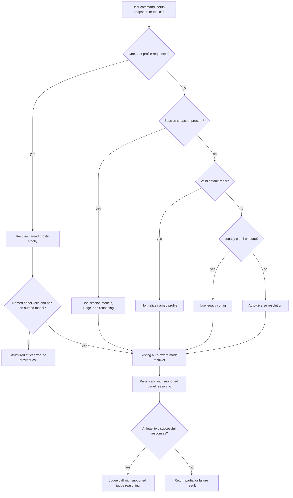
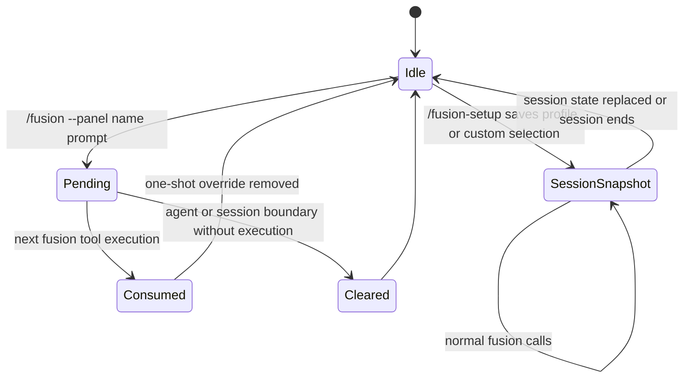

# Fusion Profiles, Reasoning, and Status Integration - Plan

## Goal Capsule

| Field | Value |
|---|---|
| Objective | Resolve GitHub issues #12, #13, and #14 by adding reusable named panels, independent panel/judge reasoning effort, and status-only footer integration. |
| Authority | Current GitHub issue contracts, installed Pi 0.79.3 declarations/provider behavior, repository instructions, then existing implementation patterns. |
| Execution profile | Test-protected cross-cutting feature work across config resolution, runtime calls, session/UI state, commands, and documentation. |
| Stop conditions | Stop if an installed Pi API contradicts the documented reasoning/status contract or if implementation would expose model/profile/reasoning control to the invoking model. |
| Tail ownership | LFG owns implementation, simplification, review fixes, verification, commit, PR, and CI watch. |

---

## Product Contract

### Summary

Add user-owned named panel profiles and independent reasoning effort while keeping legacy configuration valid.
Allow commands to select a named profile for one run and setup to save a profile-derived session snapshot.
Publish Fusion state through Pi's keyed status API so any active footer owner renders it without duplication or clobbering.

### Problem Frame

One top-level panel cannot represent fast, quality, budget, and review tradeoffs without repeated config edits.
Panel and judge calls also lack access to Pi's provider-neutral reasoning levels, preventing users from choosing a stronger effort for difficult deliberations.
The current custom footer now duplicates other footer extensions and can clear their singleton footer ownership, even though Fusion only needs to contribute status text.

### Requirements

**Named profiles**

- R1. Users can define named profiles containing model identifiers, an optional judge, and optional panel/judge reasoning overrides.
- R2. `defaultPanel` selects the default named profile when no one-shot or session snapshot is active.
- R3. Existing top-level `panel` and `judge` configuration behaves unchanged when named profiles are absent or no valid default is selected.
- R4. `/fusion --panel <name> <prompt>` in interactive mode and `/fusion-report --panel <name> <prompt>` in interactive or print mode use the named panel for that invocation only; print-mode `/fusion --panel` rejects with guidance because it cannot carry extension state into a later tool call.
- R5. `/fusion-setup` can load a named profile and persist its resolved models, judge, and reasoning as a custom session snapshot.
- R6. An explicitly requested unknown, malformed, empty, or zero-auth profile fails clearly without falling back to another panel.
- R7. An invalid configured `defaultPanel` warns and falls through to legacy configuration or auto-diverse selection.

**Reasoning effort**

- R8. Top-level `panelReasoning` and `judgeReasoning` accept Pi's `minimal`, `low`, `medium`, `high`, and `xhigh` levels.
- R9. Named profiles may override the top-level panel and judge reasoning independently.
- R10. Panel effort applies to every panel completion, including tool-loop turns and forced finalization; judge effort applies only when judge synthesis runs.
- R11. A requested effort unsupported by a model is omitted for that model with a visible non-fatal warning rather than silently clamped.

**User control and observability**

- R12. The registered `fusion` tool continues to expose only prompt and context controls; models cannot choose profiles, panel members, judge, reasoning, token budgets, temperature, tools, or consent.
- R13. Progress, diagnostics, `/fusion-status`, setup summaries, and full status text identify the effective profile when one is active and report effective reasoning configuration.
- R14. Project-local config continues to take precedence over global config without merging files.

**Status coexistence**

- R15. Fusion publishes full or compact text only through `ctx.ui.setStatus("fusion", text)`.
- R16. `footerDisplay: "off"` clears only Fusion's keyed status with `setStatus("fusion", undefined)`.
- R17. No Fusion path calls `setFooter`, including cleanup, off, lifecycle refresh, or missing-panel paths.
- R18. The backward-compatible `footerDisplay` key remains supported but is described as Fusion status verbosity.

**Runtime compatibility**

- R19. Published package metadata requires `@earendil-works/pi-ai`, `@earendil-works/pi-coding-agent`, and `@earendil-works/pi-tui` 0.74.0 or newer, the earliest published package line verified to contain the required reasoning, status, session-id, and agent-lifecycle contracts.

### Acceptance Examples

- AE1. Given named profiles `quality` and `fast` with `defaultPanel: "quality"`, a normal tool call uses `quality`, while `/fusion-report --panel fast ...` uses `fast` once and the next normal call returns to `quality`.
- AE2. Given a legacy config with only top-level `panel` and `judge`, resolution and displayed state match current behavior.
- AE3. Given `/fusion --panel missing explain this`, the command reports the missing named panel before sending the forced prompt and incurs no provider calls.
- AE4. Given `panelReasoning: "high"` and a named profile with `judgeReasoning: "xhigh"`, supported panel models receive `high`, the judge receives `xhigh`, and unsupported models run without the requested effort plus a warning.
- AE5. Given a tool-enabled panel model reaches its loop cap, its final tool-free completion retains the selected panel reasoning level.
- AE6. Given another extension owns the footer, Fusion full/compact/off updates only the `fusion` status key and never replaces or restores the singleton footer.
- AE7. Given a named profile is loaded in setup and then manually edited, the saved session is a custom snapshot rather than a live link to later config-file changes.

### Scope Boundaries

- Per-model reasoning objects, profile inheritance, autonomous model-selected profiles, and generalized presets for every numeric/tool option are deferred.
- Named profiles contain models, judge, and role-level reasoning only; existing global token, temperature, tool, consent, and display knobs remain shared.
- This work does not publish a release or tag; it records user-visible changes for the next release.
- Fusion does not become a footer owner and does not reproduce Pi's cwd, usage, model, or third-party status rendering.

---

## Planning Contract

### Key Technical Decisions

- KTD1. Normalize a selected named profile into the existing panel/judge resolution inputs instead of creating a second model-resolution algorithm.
  This preserves auth filtering, size limits, deduplication, warnings, and fallback behavior in one place.
- KTD2. Treat command `--panel` as consume-once extension state, while setup persists a profile-derived session snapshot.
  This matches invocation syntax without granting the later model-controlled tool call a profile parameter or surprising subsequent calls.
- KTD3. Make explicit profile selection strict and configured defaults permissive.
  Explicit requests must not silently change cost or quality; a stale default should keep the extension usable with a warning and legacy/auto fallback.
- KTD4. Use Pi's exported reasoning vocabulary and `getSupportedThinkingLevels(model)` before passing the generic `reasoning` option through the existing `complete()` path.
  The installed providers already map that option, so provider-specific payload construction and a completion-path migration are unnecessary.
- KTD5. Omit unsupported reasoning rather than calling Pi's clamp helper.
  Silent substitution would violate the requested effort, while a warning preserves transparency and graceful mixed-panel execution.
- KTD6. Replace the custom footer renderer with one final keyed status update.
  `setStatus` composes with built-in and third-party footer owners; `setFooter` is singleton ownership and is outside Fusion's responsibility.
- KTD7. Centralize named-profile argument parsing and effective-config selection in pure helpers.
  `/fusion`, `/fusion-report`, resolution, setup, status, and lifecycle refresh must not drift on precedence or error semantics.
- KTD8. Require Pi 0.74.0 or newer in peer metadata instead of maintaining a partial compatibility shim.
  Set `@earendil-works/pi-ai`, `@earendil-works/pi-coding-agent`, and `@earendil-works/pi-tui` to `>=0.74.0`; npm tarballs confirm this earliest published line already contains the generic reasoning levels/provider mappings, keyed status, session ID, and agent lifecycle APIs used by the design.

### Assumptions

- One-shot `/fusion --panel` state is extension-controlled and bound to the current session plus the agent turn started by the command.
- The pending profile survives unrelated tools and internal turns in that agent run, is consumed atomically by the first Fusion execution even when strict resolution fails, and clears on agent end, session replacement/tree navigation, reload, or a newer one-shot command.
- Setup profile selection copies models, judge, and reasoning into a detached custom session snapshot.
- Reasoning warnings are computed deterministically before concurrent panel calls, and judge warnings are added only when judge synthesis is attempted.
- Named profiles use `models` rather than the legacy top-level `panel` key to match issue #12's proposed profile shape.
- User-facing text calls the feature “named panels”; implementation prose may use “profile” for the config object when needed to distinguish it from the resolved model list.
- `footerDisplay` retains its public name to avoid an unnecessary config migration.

### High-Level Technical Design

### System-Wide Impact

| Surface | Effective-state responsibility | Failure and parity requirement |
|---|---|---|
| Registered `fusion` tool | Consume user/session/config state without accepting config parameters. | Strict selection errors return structured Fusion failure before provider calls; effective profile and reasoning remain visible in details. |
| `/fusion` | Parse and acknowledge a one-shot named panel, arm it for the command-created agent run, then send the forced prompt. | A missing/unusable panel is rejected before the prompt is sent; print mode rejects the stateful form; an unused selection warns and clears at agent/session end. |
| `/fusion-report` | Parse the same syntax and pass a direct one-shot override to execution. | Errors, warnings, and effective choices match the tool path without modifying the editor with a misleading report. |
| `/fusion-setup` | Copy a configured profile into a persistent session snapshot. | The saved values are detached from later config-file changes and resume as a custom snapshot. |
| `/fusion-status` and lifecycle refresh | Render the same normalized session/config state used by execution. | Every refresh publishes `text | undefined`, so switching to an empty session clears stale Fusion status. |
| Progress and `FusionDetails` | Report the requested/effective profile plus role-level reasoning and affected-model warnings. | Cost/control observability does not depend on full or compact status display. |
| Package consumers | Resolve Pi APIs from peers at or above the verified 0.74.0 minimum. | Installation rejects older unsupported peer versions rather than failing after load. |

### Risks and Dependencies

- **One-shot state can leak to unrelated work.** Bind it to `sessionManager.getSessionId()` and the command-created agent run, consume it once, and clear it at agent/session terminal paths while allowing unrelated tools and internal turns before Fusion.
- **Default fallback can skip the legacy panel.** Model resolution must iterate ordered candidates—session snapshot, named default, legacy config, then auto—while reusing one identifier/auth helper; tests distinguish malformed, zero-auth, partial-auth, and valid candidates.
- **Strict failures can spend against fallback models or crash command flows.** Use a typed selection outcome and convert strict errors into the existing structured Fusion failure before any completion; slash commands surface the same error text.
- **Display and execution can diverge.** All command, setup, status, preview, and execution surfaces consume the same normalized effective-state result, with a parity matrix covered by tests.
- **Reasoning changes token use, latency, and cost by provider.** Preserve current token-cap inputs, document that thinking may consume provider budget, and cover reasoning-enabled caps, tool-loop finalization, judge budgets, and unset-reasoning characterization.
- **Wildcard peers can hide API incompatibility.** Set the aligned Pi peer minimum to 0.74.0, the earliest published tarballs verified to contain every required contract, and update lock/package verification.
- **Keyed status can become stale.** Lifecycle refresh always calls `setStatus("fusion", computedText)` even when the state is empty; no cleanup path touches a foreign footer or status key.

### Sources and Research

- GitHub issues [#12](https://github.com/synthetic-recon/pi-fusion/issues/12), [#13](https://github.com/synthetic-recon/pi-fusion/issues/13), and [#14](https://github.com/synthetic-recon/pi-fusion/issues/14) define the user-facing contracts.
- `src/config.ts`, `src/models.ts`, and `src/fusion.ts` establish config defaults and session/config/auto model precedence.
- `src/index.ts` and `src/ui.ts` establish custom-entry session persistence, command flow, status display, and the two-section setup UI.
- `node_modules/@earendil-works/pi-ai/dist/types.d.ts`, `models.d.ts`, and built-in provider implementations establish the generic reasoning levels, support query, and provider mappings used by `complete()`.
- `node_modules/@earendil-works/pi-coding-agent/dist/core/extensions/types.d.ts` distinguishes keyed `setStatus` composition from singleton `setFooter` ownership.
- The earlier footer-preservation plan in `docs/plans/2026-06-30-001-fix-footer-extension-statuses-plan.md` explains the custom-footer approach that issue #14 now supersedes.
- No `CONCEPTS.md` or `docs/solutions/` corpus exists, so there are no institutional learnings to carry forward.

---

## Implementation Units

### U1. Define and normalize named profile configuration

- **Goal:** Add a runtime-safe, backward-compatible effective-config resolver for named profiles and role-level reasoning.
- **Requirements:** R1, R2, R3, R6, R7, R8, R9, R14; AE1, AE2, AE3
- **Dependencies:** None
- **Files:** `src/types.ts`, `src/config.ts`, `src/__tests__/config.test.ts`
- **Approach:** Define named profile and reasoning fields, validate parsed JSON shapes at the selection boundary, and return effective panel/judge/reasoning plus selected-profile metadata and deterministic warnings/errors. Keep `loadConfig()` first-file-wins behavior and preserve existing numeric defaults.
- **Execution note:** Start with failing pure tests for precedence, strict explicit selection, permissive invalid defaults, malformed data, and legacy compatibility.
- **Patterns to follow:** `applyDefaults()` as the normalization boundary; current plain interfaces and warning strings; no runtime dependency additions.
- **Test scenarios:** Explicit named selection returns its models/judge/reasoning; `defaultPanel` resolves when no override exists; profile reasoning overrides top-level reasoning by role; legacy-only config is unchanged; unknown/malformed/empty explicit profiles return a strict error; invalid default warns and falls through; max-panel configuration remains available to model resolution.
- **Verification:** All effective-config outputs are deterministic and no caller must reimplement named-profile precedence.

### U2. Integrate profiles with model resolution and observable results

- **Goal:** Make resolution and execution use the same effective profile while preserving the existing auth-aware resolver.
- **Requirements:** R2, R3, R6, R7, R12, R13, R14; AE1, AE2, AE3
- **Dependencies:** U1
- **Files:** `src/fusion.ts`, `src/models.ts`, `src/types.ts`, `src/__tests__/models.test.ts`, `src/__tests__/fusion.test.ts`
- **Approach:** Normalize config into an ordered candidate result before building existing resolve options, carry profile metadata and config warnings through both preview and execution paths, fail strict explicit profiles before fallback, retry legacy config after an unusable permissive default, and expose the active profile in progress/details without adding registered tool parameters.
- **Patterns to follow:** `buildResolveOptions()`, `resolvePanelAndJudge()`, `ResolveResult.warnings`, and current `FusionDetails` diagnostics.
- **Test scenarios:** Named models use existing unknown/unauthed filtering and configured size limits; a zero-auth explicit profile fails with zero provider calls; malformed, zero-auth, partially authed, and valid defaults advance through the correct candidates; legacy recovery occurs before auto-selection; named judge fallback remains deterministic; preview and execution select the same profile; tool schema remains free of config override fields.
- **Verification:** Resolution behavior has one model-selection implementation, and diagnostics identify the profile and warnings that shaped execution.

### U3. Add one-shot command selection and setup snapshots

- **Goal:** Let users select profiles safely from both command and interactive surfaces.
- **Requirements:** R4, R5, R6, R12, R13; AE1, AE3, AE7
- **Dependencies:** U1, U2
- **Files:** `src/index.ts`, `src/ui.ts`, `src/__tests__/index.test.ts`, `src/__tests__/ui.test.ts`
- **Approach:** Add a shared leading-option parser that consumes only `--panel <name>` and preserves the remaining prompt verbatim. Bind `/fusion` consume-once state to the current session and command-created agent run, pass a direct override to `/fusion-report`, and consume or clear it atomically at agent/session boundaries. Reject stateful `/fusion --panel` in print mode. Put a keyboard-operated Profile row first in setup Config when named panels exist; selecting a name copies its models/judge/reasoning into a detached session snapshot. Hide the row when no named panels exist and preserve save/cancel behavior.
- **Execution note:** Characterize current mode-command and prompt parsing before adding flags, then prove the delayed `/fusion` handoff and cleanup paths.
- **Patterns to follow:** `persistSessionState()`/`restoreSessionState()`, `sessionFusionOptions()`, generic setup `ConfigRow` cycling, and current command print/UI dual behavior.
- **Test scenarios:** Both commands consume only a leading profile option and preserve the remaining prompt verbatim; missing `--panel` value and unknown names fail before dispatch; print-mode `/fusion --panel` rejects with guidance while print-mode report works; pending selection is session-bound and consumed once; setup copies named profile values into a detached snapshot; resumed snapshots stay frozen after config edits.
- **Verification:** One-shot and persistent selection semantics are distinct, visible, and cannot leak across unrelated turns or sessions.

### U4. Thread independent reasoning through all model calls

- **Goal:** Apply supported panel and judge reasoning without provider-specific branching or silent substitution.
- **Requirements:** R8, R9, R10, R11, R12, R13; AE4, AE5
- **Dependencies:** U1, U2
- **Files:** `src/llm.ts`, `src/fusion.ts`, `src/types.ts`, `src/__tests__/llm.test.ts`, `src/__tests__/fusion.test.ts`
- **Approach:** Extend the existing raw completion options with Pi's generic reasoning type, use a pure helper backed by `getSupportedThinkingLevels(model)` to return either the requested level or a warning, and pass the result separately to panel and judge calls. Keep `complete()` because installed built-in providers already translate generic reasoning; reuse the constructed panel options through every tool-loop iteration and forced finalization.
- **Execution note:** Preserve the existing `complete()` path and characterize no-reasoning plus temperature-suppression behavior before adding effort.
- **Patterns to follow:** `buildCompleteOptions()`, `getSupportsTemperature()`, immutable tool-loop options, and existing warning aggregation.
- **Test scenarios:** Supported minimal/high levels pass through; unsupported non-reasoning and unsupported xhigh levels are omitted with model-specific warnings; mixed panels continue; panel and judge levels remain independent; judge warnings appear only when synthesis runs; tool-loop turns and finalization share one reasoning option; reasoning-enabled token caps and judge budgets keep their current input semantics; unset reasoning leaves current options and temperature suppression unchanged.
- **Verification:** Every completion site receives the intended supported role-level effort, and unsupported requests remain observable without breaking partial-success behavior.

### U5. Relinquish footer ownership and publish keyed status

- **Goal:** Make Fusion coexist with any built-in or third-party footer owner.
- **Requirements:** R13, R15, R16, R17, R18; AE6
- **Dependencies:** U3
- **Files:** `src/index.ts`, `src/ui.ts`, `src/__tests__/index.test.ts`
- **Approach:** Reduce `updateStatus()` to compute the current full/compact/off Fusion text and issue one `setStatus("fusion", text | undefined)` call. Invoke it unconditionally on relevant lifecycle refreshes so empty sessions clear stale text. Remove custom footer rendering, footer-data formatting helpers, unused widget cleanup, ownership restoration, and related imports/tests. Full status orders mode, named panel or custom marker, panel count, panel/judge reasoning, judge, then tools; compact remains mode plus panel count; off and empty publish `undefined`.
- **Execution note:** Replace the current custom-footer regression test with a failing non-ownership test before deleting the renderer.
- **Patterns to follow:** Pi's keyed status contract and the existing pure `fusionFooterText()` formatting boundary.
- **Test scenarios:** Full formatting preserves the canonical priority order; compact publishes only mode and panel count; off and missing available panel clear only `fusion`; a populated-to-unconfigured lifecycle transition clears stale Fusion text; a fake foreign footer and foreign status remain untouched; `setFooter` is never called.
- **Verification:** Static search and lifecycle tests prove no runtime path in Fusion calls `setFooter`.

### U6. Update public configuration and contributor-facing documentation

- **Goal:** Document the final behavior and remove descriptions of Fusion as a footer owner.
- **Requirements:** R1, R2, R4, R5, R8, R9, R11, R13, R18
- **Dependencies:** U1, U2, U3, U4, U5
- **Files:** `README.md`, `CHANGELOG.md`, `docs/pi-api-notes.md`, `src/config.ts`, `package.json`, `package-lock.json`
- **Approach:** Update the generated config example, config reference, precedence, command examples, setup behavior, reasoning support/warnings, status terminology, privacy/cost guidance, verified Pi peer minimum, and next-release changelog. Remove resolved custom-footer API notes while retaining unrelated Pi workarounds.
- **Patterns to follow:** Current README configuration table, exact JSON examples, and changelog user-outcome language.
- **Test expectation:** No new unit behavior; `/fusion-init` output is covered by U1 config tests, and package/document verification catches stale publish surfaces.
- **Verification:** Documentation examples match accepted config types and command semantics, and no text claims Fusion owns or restores the footer.

---

## Verification Contract

| Gate | Command | Proves |
|---|---|---|
| Focused config/model tests | `node --import jiti/register src/__tests__/config.test.ts` and `node --import jiti/register src/__tests__/models.test.ts` | Profile precedence, validation, auth filtering, and legacy compatibility. |
| Focused runtime tests | `node --import jiti/register src/__tests__/fusion.test.ts` and `node --import jiti/register src/__tests__/llm.test.ts` | Role-level reasoning support/warnings and pipeline propagation. |
| Focused command/UI tests | `node --import jiti/register src/__tests__/index.test.ts` and `node --import jiti/register src/__tests__/ui.test.ts` | One-shot lifecycle, session snapshots, status publication, and footer non-ownership. |
| Full test suite | `npm test` | New and existing behavior passes under the custom harness. |
| Type check | `npm run check` | Public config/session/result types and installed Pi APIs compile. |
| Strict dead-code check | `npx tsc --noEmit --noUnusedLocals --noUnusedParameters` | Removed footer helpers and new profile/reasoning plumbing leave no dead symbols. |
| Package surface | `npm pack --dry-run` | Published files and documentation remain complete without test leakage. |
| Live Pi smoke | `pi -e .` | Named profile commands/setup work with real auth state, reasoning warnings are readable, and Fusion status coexists with another footer owner. |

---

## Definition of Done

- U1-U6 satisfy every cited requirement and acceptance example.
- All three open issues are referenced and closed by the pull request when the implemented behavior matches their contracts.
- Explicit profile selection never silently substitutes a different panel, and configured defaults degrade with a warning.
- The invoking model cannot control profile, panel, judge, reasoning, tools, consent, temperature, or budgets.
- Default profile, explicit one-shot, session snapshot, legacy config, and auto-selection produce consistent effective state across commands, setup, status, tool execution, lifecycle refresh, progress, and diagnostics.
- One-shot state is session/turn bound, consumed at most once, and cleared on every terminal path without crossing sessions.
- Supported reasoning reaches all intended completion calls; unsupported reasoning is omitted with deterministic warnings.
- Fusion publishes only keyed status and contains no `setFooter` call or custom footer renderer.
- Legacy config remains valid, unaffected pre-existing tests continue to pass, and obsolete custom-footer tests are replaced by keyed-status non-ownership coverage.
- Package metadata requires Pi 0.74.0 or newer, matching the earliest published package line verified to contain the APIs used by the implementation.
- README, changelog, Pi API notes, and generated config examples match the shipped behavior.
- Every verification gate passes, including a live coexistence smoke test where the environment permits it.
- Dead-end experiments, temporary diagnostics, and abandoned code paths are absent from the final diff.
